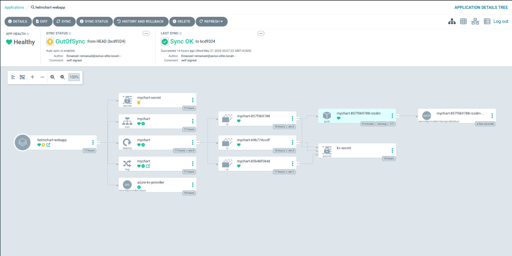
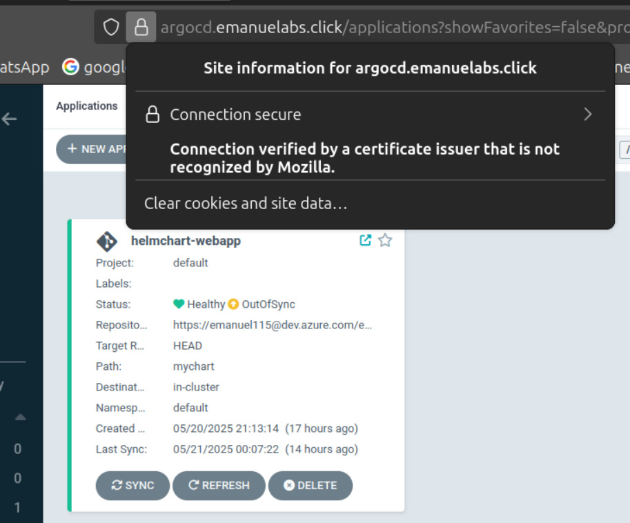
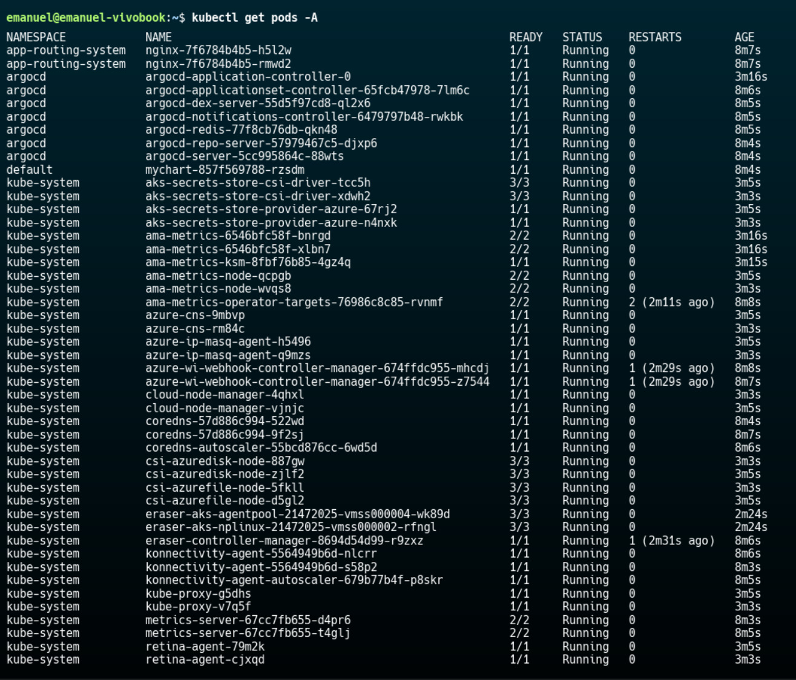
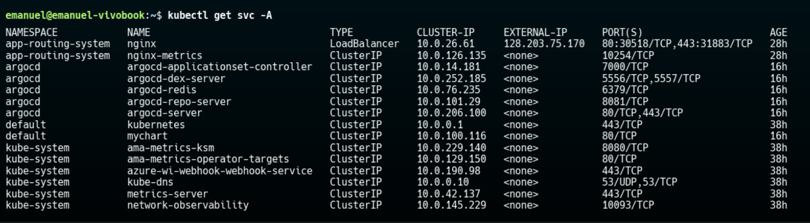

# AKS Deployment with Application Routing, Azure Key Vault, and Web App

This README describes the steps to:

- Create an Azure Kubernetes Service (AKS) cluster
- Enable the HTTP Application Routing add-on (Web App Routing)
- Create and configure an Azure Key Vault for secret management
- Assign Key Vault permissions to the AKS cluster
- Deploy a sample web application to AKS
- Configure Ingress using the Web App Routing add-on

---

## Prerequisites

- Azure CLI installed and logged in (`az login`)
- An existing Azure subscription
- `kubectl` installed and configured
- Helm installed (for CSI driver and provider)

## Variables

| Variable               | Description                                               |
|------------------------|-----------------------------------------------------------|
| `RG`                   | Resource group name                                       |
| `AKS_CLUSTER_NAME`     | Name for the AKS cluster                                  |
| `LOCATION`             | Azure region (e.g., `eastus`)                             |
| `KEYVAULT_NAME`        | Name for the Azure Key Vault                              |
| `SECRET_NAME`          | Name of the secret to store in Key Vault                  |
| `SECRET_VALUE`         | Value of the secret                                       |
| `WEBAPP_NAMESPACE`     | Kubernetes namespace for the web application (`webapp`)   |
| `WEBAPP_DEPLOYMENT`    | Name of the Kubernetes Deployment (`webapp-deploy`)       |
| `WEBAPP_SERVICE`       | Name of the Kubernetes Service (`webapp-svc`)             |

---

## 1. Create Resource Group

```bash
az group create   --name $RG   --location $LOCATION
```

## 2. Create Azure Key Vault and Store Secret

```bash
az keyvault create   --name $KEYVAULT_NAME   --resource-group $RG   --location $LOCATION

az keyvault secret set   --vault-name $KEYVAULT_NAME   --name $SECRET_NAME   --value "$SECRET_VALUE"
```

## 3. Create AKS Cluster with HTTP Application Routing Add-on

Enable the HTTP Application Routing add-on to automatically provision an NGINX ingress controller and external IP address. ([learn.microsoft.com](https://learn.microsoft.com/en-us/azure/aks/app-routing?utm_source=chatgpt.com))

```bash
az aks create   --resource-group $RG   --name $AKS_CLUSTER_NAME   --location $LOCATION   --generate-ssh-keys   --enable-addons http_application_routing   --network-plugin azure   --node-count 2
```

Fetch credentials:

```bash
az aks get-credentials   --resource-group $RG   --name $AKS_CLUSTER_NAME
```

## 4. Assign Key Vault Permissions to AKS

Grant the AKS cluster's managed identity access to read secrets from Key Vault. ([cloudyuga.guru](https://cloudyuga.guru/blogs/understanding-ingress-in-aks/?utm_source=chatgpt.com))

```bash
# Retrieve the AKS cluster's principal ID
AKS_PRINCIPAL_ID=$(az aks show   --resource-group $RG   --name $AKS_CLUSTER_NAME   --query "identityProfile.kubeletidentity.clientId"   -o tsv)

# Assign "get" and "list" permissions on secrets
az keyvault set-policy   --name $KEYVAULT_NAME   --object-id $AKS_PRINCIPAL_ID   --secret-permissions get list
```

## 5. Deploy Secrets Store CSI Driver and Azure Key Vault Provider

Install the Secrets Store CSI driver and the Azure Key Vault provider using Helm:

```bash
helm repo add csi-secrets-store-provider-azure   https://azure.github.io/secrets-store-csi-driver-provider-azure/
helm repo update
helm install csi-secrets-store-provider-azure   csi-secrets-store-provider-azure/csi-secrets-store-provider-azure
```

Create a `SecretProviderClass` to reference the Key Vault secret:

```yaml
# secretproviderclass.yaml
apiVersion: secrets-store.csi.x-k8s.io/v1
kind: SecretProviderClass
metadata:
  name: akv-secret-provider
spec:
  provider: azure
  parameters:
    usePodIdentity: "false"
    useVMManagedIdentity: "true"             # Use the AKS managed identity
    userAssignedIdentityID: "<CLIENT_ID>"   # (optional) if using user-assigned
    keyvaultName: "$KEYVAULT_NAME"
    objects: |                              # Secrets to fetch
      array:
      - objectName: $SECRET_NAME
        objectType: secret
    tenantId: "<TENANT_ID>"
```

Apply to the cluster:

```bash
kubectl apply -f secretproviderclass.yaml
```

## 6. Deploy Sample Web Application

Create a namespace and deploy a simple web app (e.g., Flask, NGINX):

```bash
kubectl create namespace $WEBAPP_NAMESPACE
kubectl apply -f deployment.yaml -n $WEBAPP_NAMESPACE
kubectl apply -f service.yaml -n $WEBAPP_NAMESPACE
```

Example `deployment.yaml`:

```yaml
apiVersion: apps/v1
kind: Deployment
metadata:
  name: $WEBAPP_DEPLOYMENT
  namespace: $WEBAPP_NAMESPACE
spec:
  replicas: 2
  selector:
    matchLabels:
      app: webapp
  template:
    metadata:
      labels:
        app: webapp
    spec:
      containers:
      - name: webapp
        image: myacr.azurecr.io/webapp:1.0
        ports:
        - containerPort: 80
        volumeMounts:
        - name: secrets-store-inline
          mountPath: /mnt/secrets
      volumes:
      - name: secrets-store-inline
        csi:
          driver: secrets-store.csi.k8s.io
          readOnly: true
          volumeAttributes:
            secretProviderClass: "akv-secret-provider"
```

## 7. Configure Ingress with Application Routing Add-on

Create an Ingress using the `webapprouting.kubernetes.azure.com` class to activate the add-on. ([learn.microsoft.com](https://learn.microsoft.com/en-us/azure/aks/app-routing?utm_source=chatgpt.com))

```yaml
# ingress.yaml
apiVersion: networking.k8s.io/v1
kind: Ingress
metadata:
  name: webapp-ingress
  namespace: $WEBAPP_NAMESPACE
spec:
  ingressClassName: webapprouting.kubernetes.azure.com
  rules:
  - http:
      paths:
      - path: /
        pathType: Prefix
        backend:
          service:
            name: $WEBAPP_SERVICE
            port:
              number: 80
```

Apply the Ingress:

```bash
kubectl apply -f ingress.yaml -n $WEBAPP_NAMESPACE
```

After a few moments, retrieve the external IP:

```bash
kubectl get ingress -n $WEBAPP_NAMESPACE
```

## 8. Verify Deployment

1. Confirm pods are running:

   ```bash
   kubectl get pods -n $WEBAPP_NAMESPACE
   ```

2. Access the web app via the Ingress IP in your browser.


---

## Cleanup

```bash
# Delete resources
az group delete --name $RG --yes --no-wait
```

## Images
# Argo CD

# Argo CD TLS

# AKS Pods

# AKS SVC

